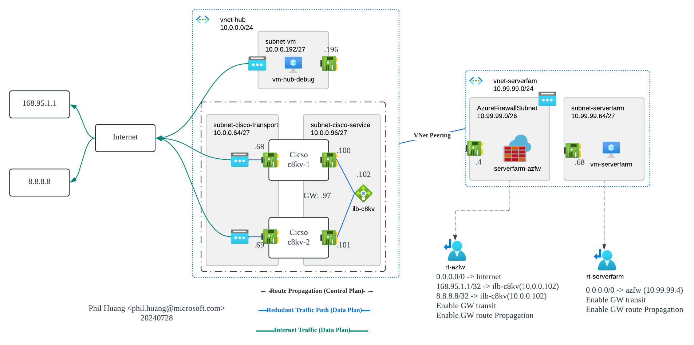

# Cisco Catalyst 8000v High Availability (c8kv ha) + Azure Firewall

## Topology

## References

- [Configuring NAT on Cisco Routers Step-by-Step (PAT, Static NAT, Port Redirection][1]
- [Cisco Catalyst 8000V Edge Software High Availability Configuration Guide][2]
- [Catalyst 8000v deployment on Azure][3]
- [How to Setup a TransitVNET in Azure with CSR 1000v and Azure Internal Load Balancer (ILB)][4]
- [customdata-examples][5]

[1]: https://www.networkstraining.com/configuring-nat-on-cisco-routers/
[2]: https://www.cisco.com/c/en/us/td/docs/routers/C8000V/HighAvailability/c8000v-high-availability-configuration-guide/overview.html
[3]: https://github.com/CiscoDevNet/sdwan-edge/tree/main/Catalyst8000v/azure
[4]: https://community.cisco.com/t5/networking-knowledge-base/how-to-setup-a-transitvnet-in-azure-with-csr-1000v-and-azure/ta-p/3895235
[5]: https://github.com/csr1000v/customdata-examples/blob/master/examples/customdata1.txt

