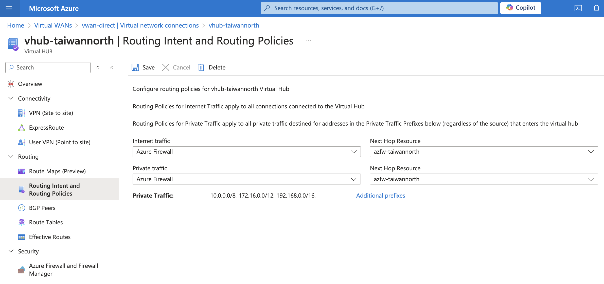
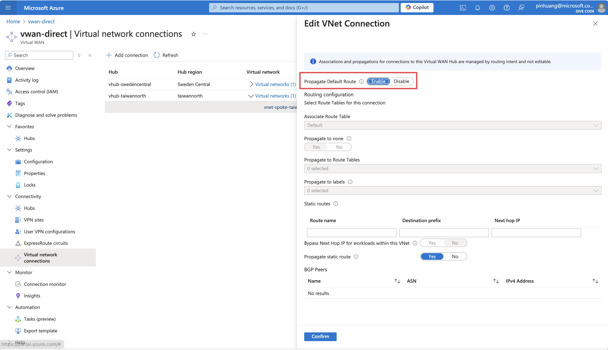
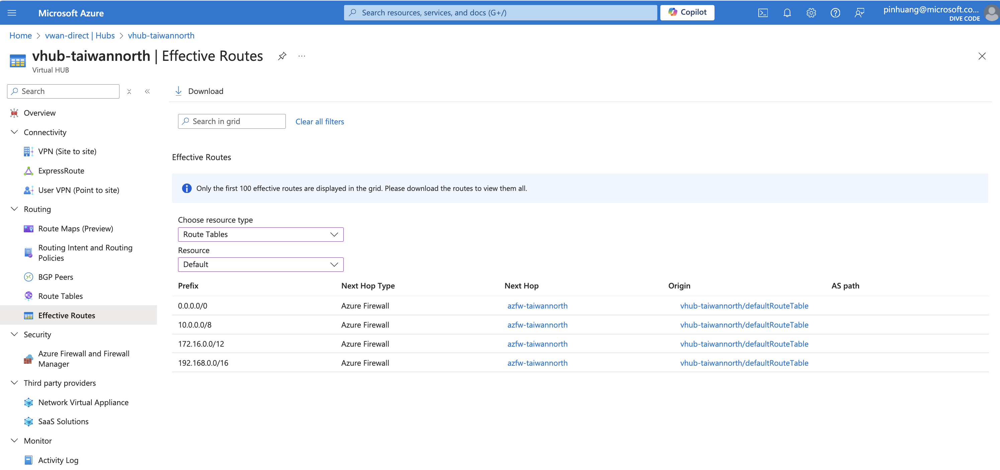
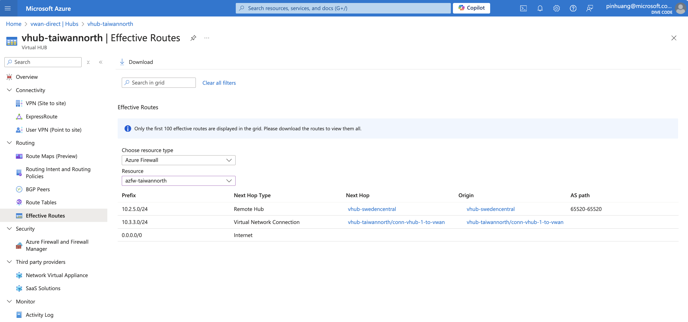
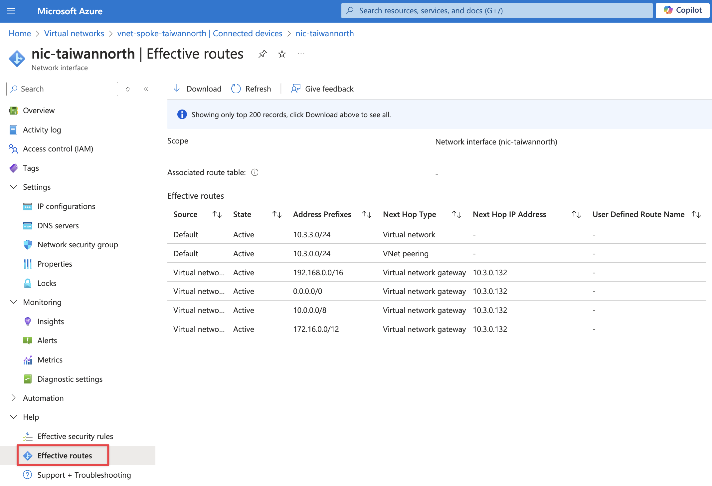
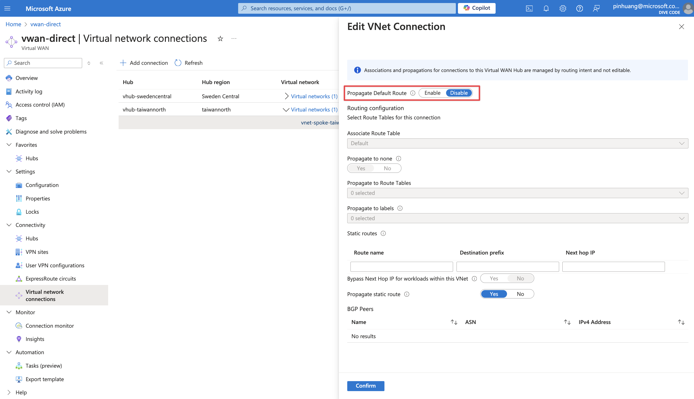
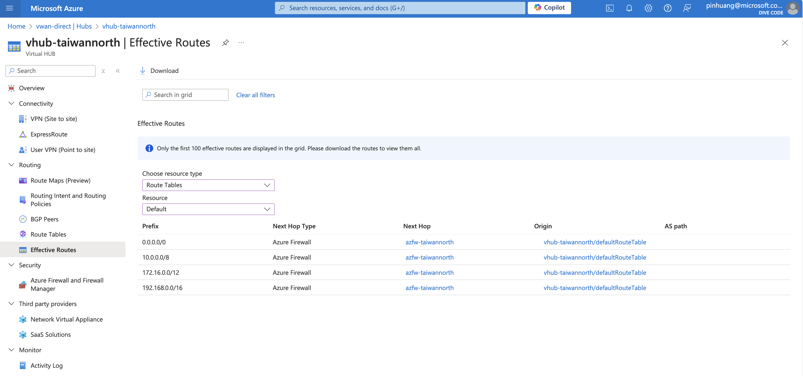
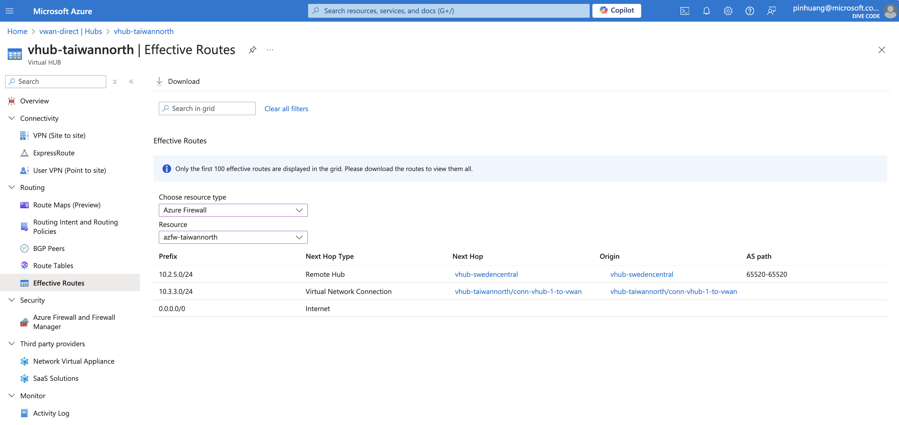
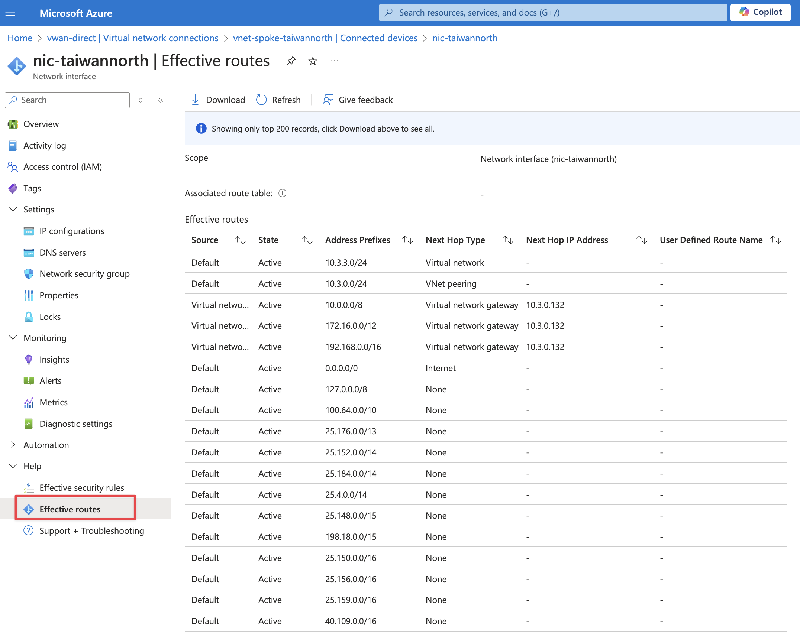

# route table information

- Enable routing intent

## A. Enable Propagate Default Route

### A.1 Virtual WAN - VNet Connection

### A.2 Virtual WAN - Effective routes - Route Tables

### A.3 Virtual WAN - Effective routes - Azure Firewall

### A.4 VM - Effective routes

## B. Disable Propagate Default Route

### B.1 Virtual WAN - VNet Connection

### B.2 Virtual WAN - Effective routes - Route Tables

### B.3 Virtual Network - Effective routes - Azure Firewall

### B.4 VM - Effective routes

