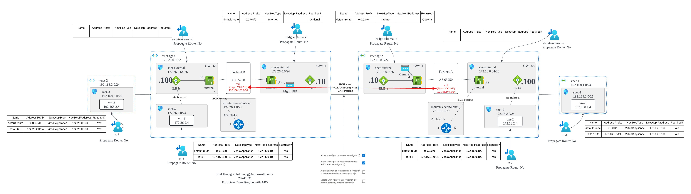
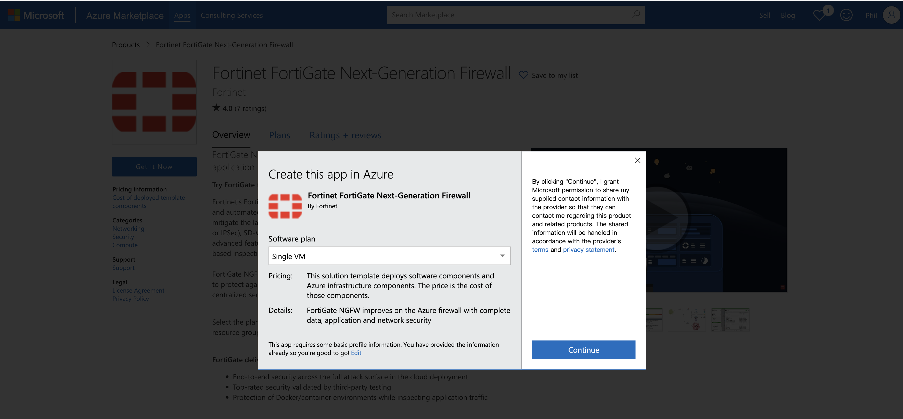
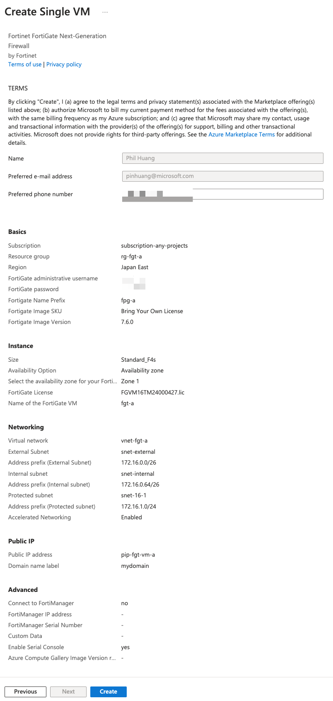

# FortiGate Cross Region with BGP Exchange

## Overview

This example demonstrates how to deploy FortiGate in two different regions and connect them with BGP.

## Architecture



## Tips

1. Regarding Hub-Spoke network traffic: when vm-1 (Spoke VM) in vnet-1 communicates with vm-2 (Hub VM) in vnet-2, you need to specifically write designated routes to FortiGate Internal (172.16.0.100) for FortiGate to function properly. Without these routes, the default direct connection via VNet Peering allows network reachability between them, but traffic won't pass through FortiGate.

2. For exchanging routes between two FortiGates: since FortiGate cannot control the contents of the Azure Route Table (external), even with BGP protocol, connecting different subnets traditionally requires manually writing routes to the Azure Route Table for network connectivity. This approach sacrifices the benefits of the BGP Dynamic Routing Protocol. The recommended approach is to use a Tunnel Interface over Azure NIC, allowing all routes to be exchanged and communicated through the Tunnel Interface. This tunnel can use GRE, IPsec, or VXLAN, with VXLAN being recommended for its lighter weight.

## Step

1. Deploy base resource without FortiGate
```
terraform init
terraform plan
terraform apply --auto-approve
```

2. Deploy FortiGate in each region

    1. Open Azure Marketplace and launch FortiGate Standalone VM. [Link][1]
        

    2. Use FortiGate `Single VM` module to deploy FortiGate in each region manually.
        


## Misc

- Check Route Table on FortiGate
```bash
get router info routing-table all
get router info routing-table static
get router info bgp summary
```

- Sniffer Packet, [Ref][3]
```bash
# Specify the interface to capture packets
diagnose sniffer packet port2 4

# Speficy the src IP 172.16.1.4 on Any to capture packets
diagnose sniffer packet any 'host 172.16.1.4' 4
```

[1]: https://azuremarketplace.microsoft.com/en-us/marketplace/apps/fortinet.fortinet-fortigate?tab=overview
[2]: https://docs.fortinet.com/index.php/document/fortigate/7.4.3/administration-guide/684039
[3]: https://community.fortinet.com/t5/FortiGate/Technical-Tip-Packet-capture-sniffer/ta-p/198313
[4]: https://github.com/40net-cloud/fortinet-azure-solutions/blob/main/FortiGate/AzureRouteServer/MultiHub/doc/config-provisioning.md